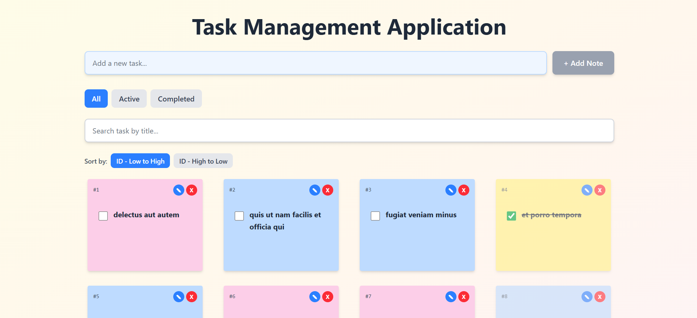

# Practical Exam for Intern-Software Engineer

Task Management Application - React Intern Practical Interview Task

## 📸 Application Preview



## Tech Stack

- **React** with Vite
- **Tailwind CSS** for styling
- **Axios** for API calls
- **React Toastify** for notifications
- **React Hooks:** useState, useEffect, useMemo

## Required Features Implemented

1. **View all tasks (READ)** - Fetch and display tasks from API
2. **Add new tasks (CREATE)** - Create tasks with form input
3. **Update existing tasks (UPDATE)** - Edit task titles inline
4. **Delete tasks (DELETE)** - Remove tasks with confirmation
5. **Mark tasks as complete/incomplete** - Toggle completion status
6. **Filter tasks by status** - All, Active, Completed filters

## Optional Features Implemented

- ✅ **Search functionality** to filter tasks by title
- ✅ **Edit task functionality** (inline editing)
- ✅ **Sorting tasks** by completion status or ID
- ✅ **Toast notifications** for actions
- ✅ **Form validation** with error messages

## Installation & Setup

```bash
# Install dependencies
npm install

# Run development server
npm run dev

```

## API Integration

Uses [JSONPlaceholder](https://jsonplaceholder.typicode.com/todos) mock REST API for CRUD operations.

---
